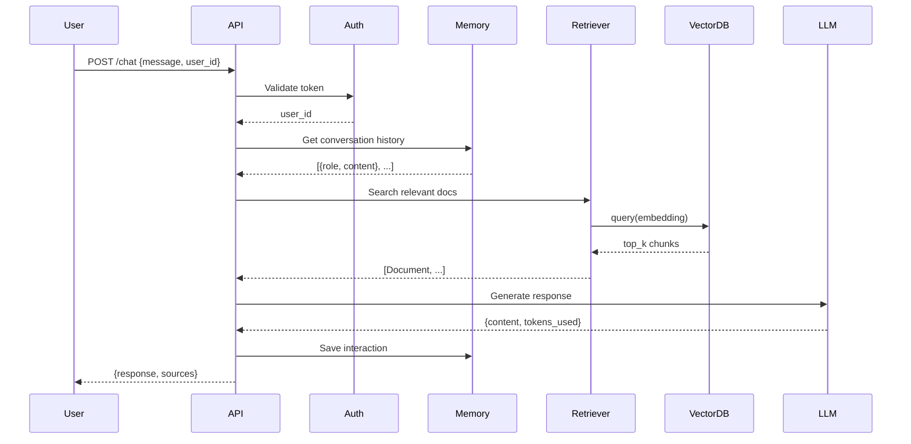

# Generating Architecture Overviews

Ask AI to analyze codebases and produce architectural summaries.

## Diagram Generation

```
Prompt: "Analyze the data flow in this project and describe it
as a Mermaid sequence diagram"
```



## Architecture Questions

```
- "What is the dependency graph of the main modules?"
- "What design patterns are used in this project?"
- "How do the microservices communicate?"
- "What's the authentication flow?"
- "How are errors propagated through the call stack?"
- "What's the data transformation pipeline from input to storage?"
```

## When to Use

- Onboarding to a new team
- Planning a major refactor
- Writing documentation
- Identifying architectural debt (circular dependencies, god classes)
